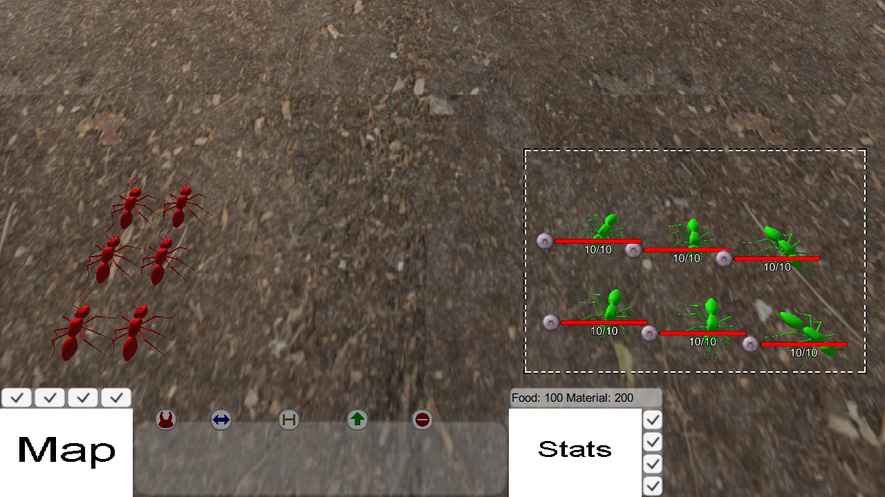

# Unity-Projects

 
Collection of small Unity test projects I created to learn the engine between 2017 and 2018.

## Table of Contents
  - [General Information](#general-information)
  - [Technologies Used](#technologies-used)
  - [How To Run](#how-to-run)
  - [Illustrations](#illustrations)
  - [Features](#features)
  - [Sources](#sources)

## General Information
Collection of small Unity test projects I created to learn the engine between 2017 and 2018.
This includes: 
- *Ocean's Solitude*: Controlling a small fish in a 2D level created with [Tiled](https://www.mapeditor.org/) where the player needs to flee from an enemy fish using abilities.
- *RTS Prototype*: Controlling multiple units via a unit statemachine and simple UI with a few enemy units to fight.

**Note**: These experiments are old and do not truly represent my current skillset for designing and implementing code. It was uploaded and published to show my previous work as part of my résumé.

## Technologies Used
- Unity: 2019.4.39f1

## How To Run
- Exported Builds:

Exported builds can be found in the `builds` directory. It includes windows exports for each projects. 

### Controls
*Ocean's Solitude*:
- WASD: Move
- Shift: Dash
- Q: Inkcloud ability
- E: Inkbomb ability

*RTS Prototype*:
- Left-Mouse Button: Select units, hold to create selection border.
- Right Mouse Button: Deselect units
- A: Attack Move (move to position, attack all enemies on the way).
- S: Stop current command
- H: Hold position
- P: Patrol between two points
- M: Move to position
- Escape: Open menu to quit.

## Illustrations
### Ocean's Solitude
Player character, functioning UI and the enemy.

Using an ability.

### RTS Prototype
Unit selection.

Attacking enemy units.

## Features
### Ocean's Solitude
- Adventure style game, where the player controls a fish with a few abilities and an enemy.
- Level created with Tiled.
- Movement Logic for Player fish with abilities.

### RTS Prototype
- Unit control with state machine that allows for commands like 'hold position', 'patrol' or 'attack'.
- Unit selection for single units and multiple units and simple movement.
- Enemy units you can attack.

## Sources
- [Tiled](https://www.mapeditor.org/): Used to create 2D tilemaps.
- [Unity Engine](https://unity.com/): Used to create test projects. All versions were tested with Unity 2019.4.39f1.
- [Tiled2Unity](https://seanba.com/supertiled2unity.html): To automatically import maps created with Tiled.
  
### Ocean's Solitude
- [Ludum Dare 29: Deep Blue Home by Jools64](https://web.archive.org/web/20170703054547/http://www.ludumdare.com/compo/ludum-dare-29/?action=preview&uid=17060): Used some of the assets for testing. A playable version of Deep Blue Home can still be found at [Newgrounds](https://www.newgrounds.com/portal/view/638327)

### RTS Prototype
- Empire of the Ants, Microids, 2000: Some sounds and music were recorded from the game for testing purposes.
